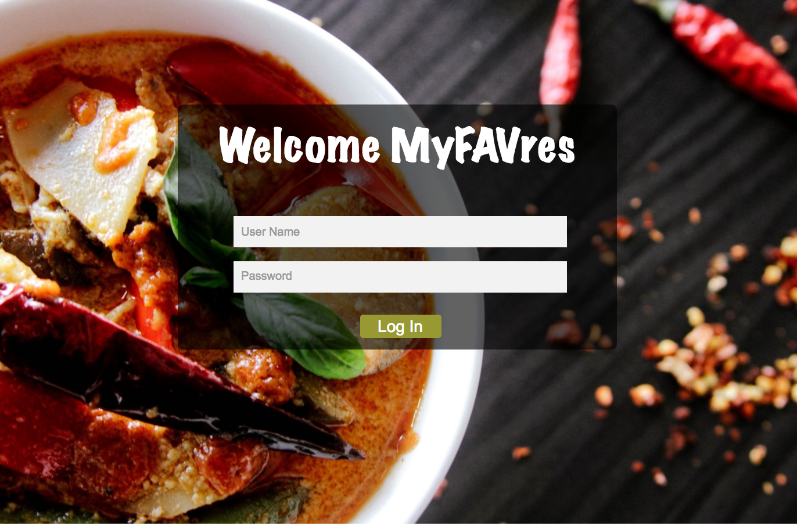
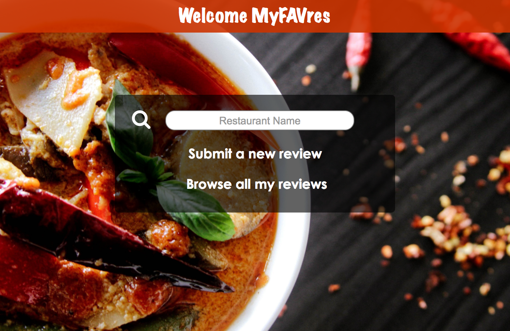

# GA-project2-Proposal

### How-to-use 
1. Users have to log in 
1. You can search the restaurant's review or wirte one
1. Allow users to edit and delete the review

### Wireframe

### API may use
1. Yelp
2. Google Places
3. Zomato
4. Facbook

### Technologies will use
1. Javascript
2. Node.js
3. Express
4. MVC model
5. SQL

